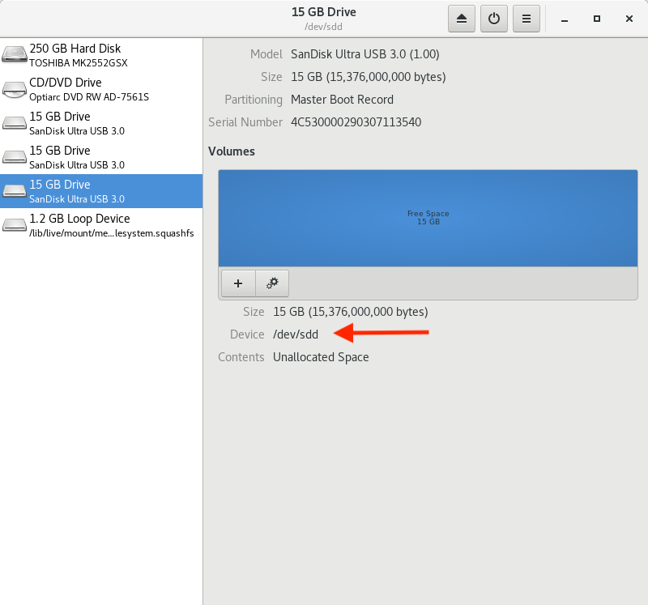
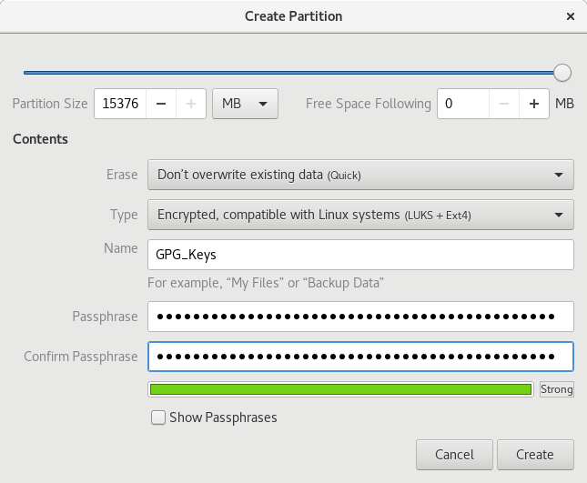
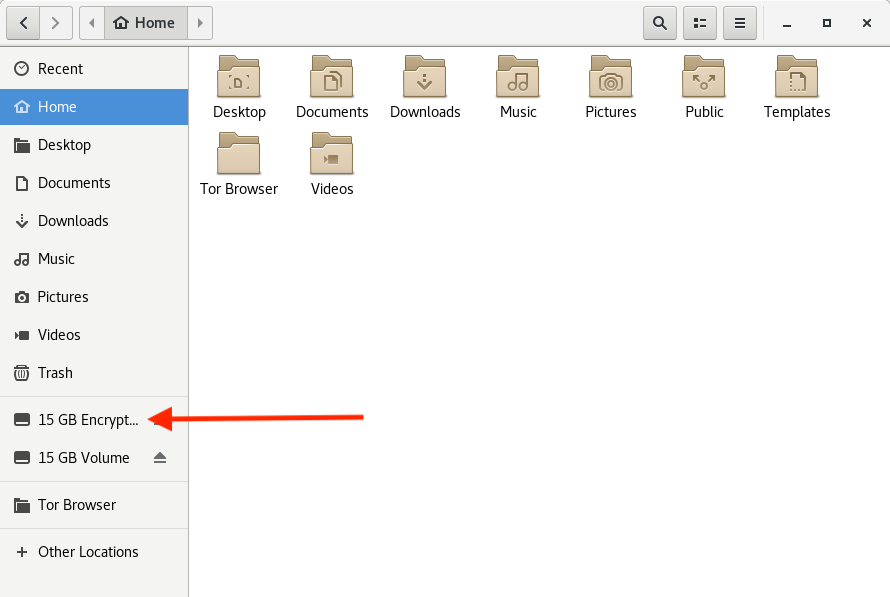
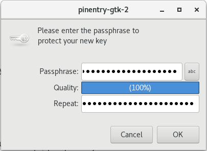
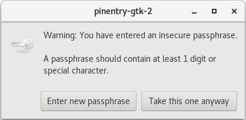
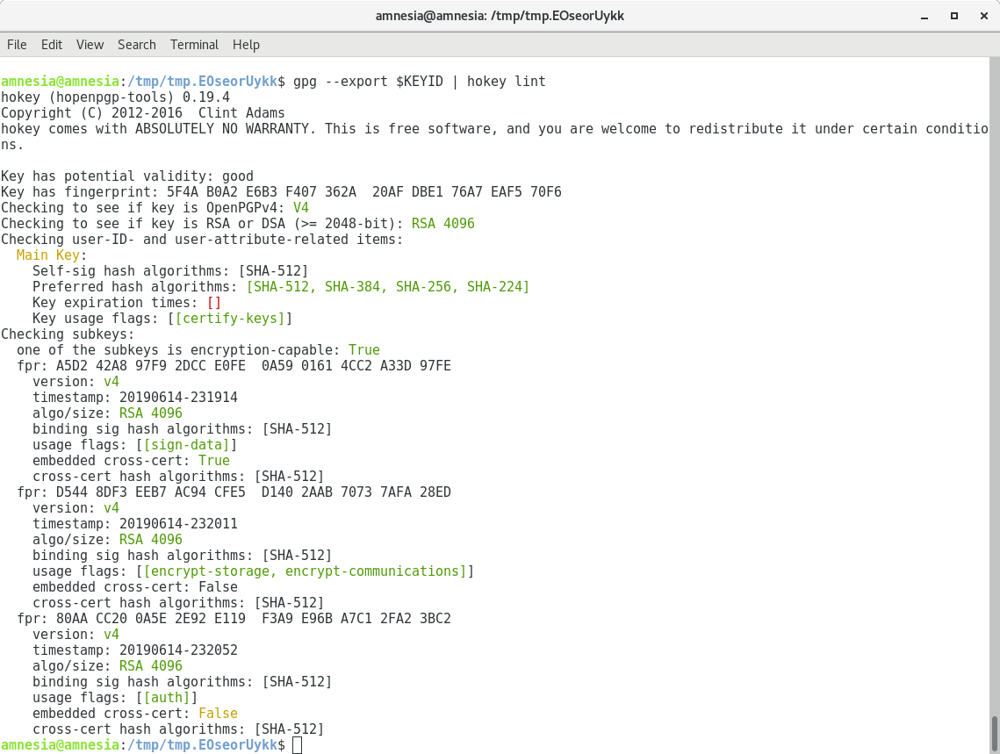

REMEMBER TO REMOVE ALL DXP: COMMENTS

This is a guide to using [YubiKey](https://www.yubico.com/products/yubikey-hardware/) as a [SmartCard](https://security.stackexchange.com/questions/38924/how-does-storing-gpg-ssh-private-keys-on-smart-cards-compare-to-plain-usb-drives) for storing GPG encryption, signing and authentication keys, which can also be used for SSH. Many of the principles in this document are applicable to other smart card devices.

Keys stored on YubiKey are non-exportable (as opposed to file-based keys that are stored on disk) and are convenient for everyday use. Instead of having to remember and enter passphrases to unlock SSH/GPG keys, YubiKey needs only a physical touch after being unlocked with a PIN code. All signing and encryption operations happen on the card, rather than in OS memory.

**New!** [drduh/Purse](https://github.com/drduh/Purse) is a password manager which uses GPG and YubiKey.

If you have a comment or suggestion, please open an [issue](https://github.com/drduh/YubiKey-Guide/issues) on GitHub.

- [Purchase YubiKey](#purchase-yubikey)
- [Verify YubiKey](#verify-yubikey)
- [Live image](#live-image)
- [Required software](#required-software)
  * [Entropy](#entropy)
- [Creating keys](#creating-keys)
- [Master key](#master-key)
- [Subkeys](#subkeys)
  * [Signing](#signing)
  * [Encryption](#encryption)
  * [Authentication](#authentication)
- [Verify keys](#verify-keys)
- [Export keys](#export-keys)
- [Backup keys](#backup-keys)
  * [Linux](#linux)
  * [OpenBSD](#openbsd)
- [Configure YubiKey](#configure-yubikey)
- [Configure Smartcard](#configure-smartcard)
  * [Change PIN](#change-pin)
  * [Set information](#set-information)
- [Transfer keys](#transfer-keys)
  * [Signing](#signing-1)
  * [Encryption](#encryption-1)
  * [Authentication](#authentication-1)
- [Verify card](#verify-card)
- [Export public key](#export-public-key)
- [Cleanup](#cleanup)
- [Using keys](#using-keys)
- [Import public key](#import-public-key)
  * [Trust master key](#trust-master-key)
- [Insert YubiKey](#insert-yubikey)
- [Encryption](#encryption-2)
- [Decryption](#decryption)
- [Signing](#signing-2)
- [Verifying signature](#verifying-signature)
- [SSH](#ssh)
  * [Create configuration](#create-configuration)
  * [Replace agents](#replace-agents)
  * [Copy public key](#copy-public-key)
  * [(Optional) Save public key for identity file configuration](#-optional--save-public-key-for-identity-file-configuration)
  * [Connect with public key authentication](#connect-with-public-key-authentication)
  * [Touch to authenticate](#touch-to-authenticate)
  * [Import SSH keys](#import-ssh-keys)
  * [Remote Machines (agent forwarding)](#remote-machines--agent-forwarding-)
  * [GitHub](#github)
  * [OpenBSD](#openbsd-1)
  * [Windows](#windows)
    + [WSL](#wsl)
      - [Prerequisites](#prerequisites)
      - [WSL configuration](#wsl-configuration)
      - [Remote host configuration](#remote-host-configuration)
      - [Final test](#final-test)
- [Troubleshooting](#troubleshooting)
- [Notes](#notes)
- [Links](#links)

# TL;DR
This is a guide for creating new GPG keys and using GPG in a very secure manner. We will generate a main GPG key, and several subkeys. Your main key will only ever be accessible within a secure live boot linux OS that won't be on the network. Your daily-use keys (subkeys of your main key) will be stored on a yubikey device. Briefly, what we will cover is:

1. Purchasing recommended hardware (flash drives, yubikey)
1. Setting up the hardware, including a live boot linux OS
1. Creating your GPG keys--a main key and several subkeys
1. Backing up your GPG keys
1. Copying your GPG subkeys to a yubikey for daily usage

Finally we will go through some use cases for how you will use your keys once created.


# Purchase YubiKey

All YubiKeys except the blue "security key" model are compatible with this guide. NEO models are limited to 2048-bit RSA keys. See [Compare YubiKeys](https://www.yubico.com/products/yubikey-hardware/compare-yubikeys/).

Consider purchasing a pair of YubiKeys, programming both, and storing one in a safe secondary location, in case of loss or damage to the first key.

# Verify YubiKey

To confirm your YubiKey is genuine open a [browser with U2F support](https://support.yubico.com/support/solutions/articles/15000009591-how-to-confirm-your-yubico-device-is-genuine-with-u2f) and go to [https://www.yubico.com/genuine/](https://www.yubico.com/genuine/). Insert your Yubico device, and click `Verify Device` to begin the process. 


Touch the YubiKey when prompted, and if asked, allow it to see the make and model of the device. If you see `Verification complete`, your device is authentic.


This website verifies the YubiKey's device attestation certificates signed by a set of Yubico CAs, and helps mitigate [supply chain attacks](https://media.defcon.org/DEF%20CON%2025/DEF%20CON%2025%20presentations/DEFCON-25-r00killah-and-securelyfitz-Secure-Tokin-and-Doobiekeys.pdf).

# Purchase USB Flash Drives
You will need three, possibly four, USB flash drives. They should be at least 8 or 16 GB in size. Kingston is a good brand. With a sharpie or label maker you should label them: "LIVE BOOT", "GPG KEYS" and "TRANSFER". Or possibly "BOOT", "KEYS" and "XFER" if your flash drives are physically small. A fourth flash drive could be used as an offsite backup of the "GPG KEYS" flash drive.

The BOOT flash drive will contain a bootable Linux distribution which will load from the drive right into memory. Nothing will be written back to the drive. That is necessary so that each boot will be a fresh start, making it difficult for attackers to install malware. We will refer to this as your "OFFLINE" machine as it will not have networking configured by default. An old laptop that can boot from a flash drive is great for this purpose. Even better if it has a physical "Wifi Off" switch.

The KEYS flash drive will store an export of your main key and all of the subkeys, as well as a copy of your `gpg.conf` file. This flash drive is all-important. It should NEVER be plugged into a USB port unless that port is on a machine running the operating system from your BOOT flash drive. You will want to encrypt the underlying partition on the KEYS flash drive before writing anything to it (see below for instructions).

The XFER flash drive will be used to move things between your online and offline machines. For example: other public keys that you want to certify (sign) will be copied to your offline machine, certified, then transferred back online to be sent to the key owner. It is up to you if you want to encrypt this flash drive, but if you do, do NOT use the same passphrase as you did for the KEYS flash drive as that could indirectly expose that passphrase to your online machine.

# Purchase OneRNG Hardware Random Number Generator (optional)
You may want to ensure your computer has enough entropy available (see Entropy section below). A great way to do this is to use a [OneRNG hardware random number generator](https://onerng.info/)

# Diceware Passphrases

Now is a good time to generate some diceware passphrases. You will need at least two passphrases: one for the encrypted partition on your "GPG KEYS" flash drive and one for your main GPG key passphrase. We recommend using the [EFF long word list](https://www.eff.org/dice) and creating at least five to eight word passphrases. 

You may also want to use your dice to generate the two PINs you will need later for the Yubikey. The PINs don't have to be numeric, you can use up to 127 ASCII characters. The first PIN will be needed each time you access the yubikey for signing, encryption, etc. The second is the admin PIN. We recommend using a two or three word passphrase for the first, and a four or five word passphrase for the second. 

Record all four passphrases on paper or in your password manager. You will want to store that paper offsite, perhaps in a safe deposit box. Kudos for memorizing the passphrases and then burning the paper.

# Bootable Live image

It is recommended to generate cryptographic keys and configure your YubiKey from a secure environment to minimize exposure. A good way to do that is by downloading and booting to a [Tails](https://tails.boum.org/index.en.html) live operating system image loaded from a USB flash drive into memory.

Download the latest image along with the signing key so you can verify its integrity:

(Tails is updated quite often. The exact version shown here is likely out of date)

```console
$ curl -LfO https://archive.torproject.org/amnesia.boum.org/tails/stable/tails-amd64-3.13.2/tails-amd64-3.13.2.img
$ curl -LfO https://tails.boum.org/tails-signing.key
$ curl -LfO https://tails.boum.org/torrents/files/tails-amd64-3.13.2.img.sig

$ gpg --import tails-signing.key 
gpg: key DBB802B258ACD84F: 1954 signatures not checked due to missing keys
gpg: key DBB802B258ACD84F: public key "Tails developers (offline long-term identity key) <tails@boum.org>" imported
[...]

$ TZ=UTC gpg --no-options --keyid-format long --verify tails-amd64-3.13.2.img.sig tails-amd64-3.13.2.img
[...]
gpg: Good signature from "Tails developers (offline long-term identity key) <tails@boum.org>" [unknown]
[...]
```

Don't worry if you see a warning like

```console
gpg: WARNING: This key is not certified with a trusted signature!
gpg:          There is no indication that the signature belongs to the owner.
```
... that just means you haven't authenticated the signing key. The downloaded image file is still correct.

Insert your "LIVE BOOT" USB flash drive and copy the image over to it:

```console
$ sudo dd if=tails-amd64-3.13.2.img of=/dev/sdc bs=4M && sync
```

If no error message is returned, Tails is being copied on the USB stick. The copy takes some time, generally a few minutes.

Shut down the computer and, if possible, disconnect any hard drives and unnecessary peripherals.

Make sure your "LIVE BOOT" USB flash drive is still inserted and boot to the live image. Temporarily configure networking to continue, as we need to update a few packages. 

[DXP: add something about the sudo password] ...

# Required software

(DXP: is this section needed? Perhaps you should remove everything in this dcument refering to other operating systems)


You will want to make sure you have the latest software since some packages may have been updated since the Tails "LIVE BOOT" flash drive was created.

You can install and update several packages required for the following steps. Open a Terminal window (Applications -> System Tools -> Terminal)

```console
$ sudo apt-get update

$ sudo apt-get install -y \
     yubikey-personalization \
     rng-tools at python-gnupg openssl
```

Disable networking for the remainder of the setup.

## Entropy

Generating keys will require a lot of randomness. To check the available bits of entropy available on Linux:

```console
$ cat /proc/sys/kernel/random/entropy_avail
849
```

Depending on the age of your hardware, it could be a few hundred bits to a few thousand bits. If your hardware shows available entropy in the few hundred bits range, you might consider getting a hardware random number generator. A hardware random number generator like [OneRNG](http://onerng.info/onerng/) will increase the speed of entropy generation and possibly its quality. To install and configure OneRNG:

```console
$ curl -LfO https://github.com/OneRNG/onerng.github.io/raw/master/sw/onerng_3.6-1_all.deb

$ sha256sum onerng_3.6-1_all.deb
a9ccf7b04ee317dbfc91518542301e2d60ebe205d38e80563f29aac7cd845ccb

$ sudo dpkg -i onerng_3.6-1_all.deb

$ echo "HRNGDEVICE=/dev/ttyACM0" | sudo tee /etc/default/rng-tools

$ sudo service rng-tools restart
```

If the service fails to start, kick off `atd` and try again:

```console
$ sudo atd ; sudo service rng-tools restart
```

You can ask the system for status of the rng-tools service. Ensure that it is running:

```console
$ systemctl status rng-tools.service
● rng-tools.service
   Loaded: loaded (/etc/init.d/rng-tools; generated)
   Active: active (running) since Fri 2019-06-14 22:37:10 UTC; 35s ago
     Docs: man:systemd-sysv-generator(8)
  Process: 10501 ExecStart=/etc/init.d/rng-tools start (code=exited, status=0/SUCCESS)
    Tasks: 4 (limit: 4689)
   CGroup: /system.slice/rng-tools.service
           └─10503 /usr/sbin/rngd -r /dev/ttyACM0
```

Plug in the OneRNG and empty `/dev/random` - the light on the device should dim briefly. Afterward, verify that the available entropy pool is re-seeded quickly.

```console
$ cat /dev/random >/dev/null
[Control-C]

$ cat /proc/sys/kernel/random/entropy_avail
3049
```

An entropy pool value between 2000 and 3000 is likely sufficient.

# Preparing your "GPG KEYS" flash drive

Insert your "GPG KEYS" USB flash drive into your laptop that is running Tails. You can use `dmesg` to find out the device name. Here it is `/dev/sdd`:

```console
$ sudo dmesg | tail
[...]
[  352.164567] sd 8:0:0:0: [sdd] 30031250 512-byte logical blocks: (15.4 GB/14.3 GiB)
[...]
``` 

Run the graphical disk utility: (Applications -> Utilities -> Disks)



Find and select the flash drive in the list of disks. Ensure you have selected the correct device (/dev/sdd above). Remove any existing partition. Add a new partition of type "LUKS + Ext4". You will be asked to name it (call it "GPG_Keys" and asked for a passphrase. Here is where you will use the first of the four diceware passphrases you created.



Once the formatting is complete, quit the disks utility, then eject and remove the "GPG KEYS" drive. Re-insert it and verify that you are prompted for a passphrase and that your passphrase will open it. If not automatically prompted, you may need to manually open the drive (double click the "Home" folder on the desktop, then double click the entry for your drive). 




# Creating keys


If not still open, you will want to open a Terminal window for the next steps (Applications -> System Tools -> Terminal)

First, create a temporary directory which will be deleted on reboot:

```console
export GNUPGHOME=$(mktemp -d); echo $GNUPGHOME
/tmp/tmp.EOseorUykk
```

Create a hardened configuration file for GPG. You can either copy the following options here to a new file called `$GNUPGHOME/gpg.conf`. Or you can use the gpg.conf already present in the /home/amnesia/.gnupg directory as it is very similar to this one. 

```console

$ cat $GNUPGHOME/gpg.conf
personal-cipher-preferences AES256 AES192 AES
personal-digest-preferences SHA512 SHA384 SHA256
personal-compress-preferences ZLIB BZIP2 ZIP Uncompressed
default-preference-list SHA512 SHA384 SHA256 AES256 AES192 AES ZLIB BZIP2 ZIP Uncompressed
cert-digest-algo SHA512
s2k-digest-algo SHA512
s2k-cipher-algo AES256
charset utf-8
fixed-list-mode
no-comments
no-emit-version
keyid-format 0xlong
list-options show-uid-validity
verify-options show-uid-validity
with-fingerprint
require-cross-certification
no-symkey-cache
throw-keyids
use-agent
```

Run gpg for the first time which will create an empty public keyring and the trustdb.

```console
$ gpg -kv
gpg: keybox '/tmp/tmp.EOseorUykk/pubring.kbx' created
gpg: /tmp/tmp.EOseorUykk/trustdb.gpg: trustdb created
gpg: using pgp trust model
```

# Creating Your Main key

The first key to generate is your Main key. It will be used for certification ONLY: to issue and certify subkeys that will be used for encryption, signing and authentication. This Main key will be kept offline on your KEYS flash drive at all times and only accessed to revoke or issue new subkeys.

You'll be prompted at some point by a GUI `pinentry` dialog to enter and verify a passphrase: this is where you will use the second of the four diceware passphrases you created above. 



Unfortunately, `pinentry` will complain if your passphrase is only lowercase letters (as would be created with diceware above). If you want, you can add a few special characters to the passphrase, but remember to record or memorize what you added. Otherwise you can ignore the warning as your five to eight word diceware passphrase should be good enough.




Generate a new key with GPG, selecting `(8) RSA (set your own capabilities)`, `Certify`-only and `4096` bit keysize. Do not set the key to expire - see [Note #3](#notes).

```console
$ gpg --expert --full-generate-key

Please select what kind of key you want:
   (1) RSA and RSA (default)
   (2) DSA and Elgamal
   (3) DSA (sign only)
   (4) RSA (sign only)
   (7) DSA (set your own capabilities)
   (8) RSA (set your own capabilities)
   (9) ECC and ECC
  (10) ECC (sign only)
  (11) ECC (set your own capabilities)
Your selection? 8

Possible actions for a RSA key: Sign Certify Encrypt Authenticate
Current allowed actions: Sign Certify Encrypt

   (S) Toggle the sign capability
   (E) Toggle the encrypt capability
   (A) Toggle the authenticate capability
   (Q) Finished

Your selection? E

Possible actions for a RSA key: Sign Certify Encrypt Authenticate
Current allowed actions: Sign Certify

   (S) Toggle the sign capability
   (E) Toggle the encrypt capability
   (A) Toggle the authenticate capability
   (Q) Finished

Your selection? S

Possible actions for a RSA key: Sign Certify Encrypt Authenticate
Current allowed actions: Certify

   (S) Toggle the sign capability
   (E) Toggle the encrypt capability
   (A) Toggle the authenticate capability
   (Q) Finished

Your selection? Q
RSA keys may be between 1024 and 4096 bits long.
What keysize do you want? (3072) 4096
Requested keysize is 4096 bits
Please specify how long the key should be valid.
         0 = key does not expire
      <n>  = key expires in n days
      <n>w = key expires in n weeks
      <n>m = key expires in n months
      <n>y = key expires in n years
Key is valid for? (0) 0
Key does not expire at all
Is this correct? (y/N) y

GnuPG needs to construct a user ID to identify your key.

Real name: Main Key
Email address:
Comment:
You selected this USER-ID:
    "Main Key"

Change (N)ame, (C)omment, (E)mail or (O)kay/(Q)uit? o

We need to generate a lot of random bytes. It is a good idea to perform
some other action (type on the keyboard, move the mouse, utilize the
disks) during the prime generation; this gives the random number
generator a better chance to gain enough entropy.

gpg: key 0xDBE176A7EAF570F6 marked as ultimately trusted
gpg: directory '/tmp/tmp.EOseorUykk/openpgp-revocs.d' created
gpg: revocation certificate stored as '/tmp/tmp.EOseorUykk/openpgp-revocs.d/5F4AB0A2E6B3F407362A20AFDBE176A7EAF570F6.rev'
public and secret key created and signed.

pub   rsa4096/0xDBE176A7EAF570F6 2019-06-14 [C]
      Key fingerprint = 5F4A B0A2 E6B3 F407 362A  20AF DBE1 76A7 EAF5 70F6
uid                              Main Key
```

As of GPG [version 2.1](https://www.gnupg.org/faq/whats-new-in-2.1.html#autorev), a revocation certificate is automatically generated at this time.

Export the key ID as a variable (`KEYID`) for use later:

```console
$ export KEYID=0xDBE176A7EAF570F6
```

# Subkeys

The Main key we created is only able to certify other keys and subkeys. We need to edit the Main key to add subkeys for Signing, Encryption and Authentication (if desired):

```console
$ gpg --expert --edit-key $KEYID

Secret key is available.

gpg: checking the trustdb
gpg: marginals needed: 3 completes needed: 1  trust model: pgp
gpg: depth: 0  valid:   1  signed:   0  trust: 0-, 0q, 0n, 0m, 0f, 1u
sec  rsa4096/0xDBE176A7EAF570F6
     created: 2019-06-14  expires: never       usage: C   
     trust: ultimate      validity: ultimate
[ultimate] (1). Main Key
```

Use 4096-bit keysize for all subkeys - or 2048-bit if you are using a NEO Yubikey.

Use a 2 year expiration - it can always be renewed later using the offline Main certification key.


## Signing Key

Create a [signing key](https://stackoverflow.com/questions/5421107/can-rsa-be-both-used-as-encryption-and-signature/5432623#5432623) by selecting `(4) RSA (sign only)`. While not present in the below transcript, at some point the pinentry dialog will appear for you to enter the main passphrase.

```console
gpg> addkey
Please select what kind of key you want:
   (3) DSA (sign only)
   (4) RSA (sign only)
   (5) Elgamal (encrypt only)
   (6) RSA (encrypt only)
   (7) DSA (set your own capabilities)
   (8) RSA (set your own capabilities)
  (10) ECC (sign only)
  (11) ECC (set your own capabilities)
  (12) ECC (encrypt only)
  (13) Existing key
Your selection? 4
RSA keys may be between 1024 and 4096 bits long.
What keysize do you want? (3072) 4096
Requested keysize is 4096 bits
Please specify how long the key should be valid.
         0 = key does not expire
      <n>  = key expires in n days
      <n>w = key expires in n weeks
      <n>m = key expires in n months
      <n>y = key expires in n years
Key is valid for? (0) 2y
Key expires at Sun 13 Jun 2021 11:19:20 PM UTC
Is this correct? (y/N) y
Really create? (y/N) y
We need to generate a lot of random bytes. It is a good idea to perform
some other action (type on the keyboard, move the mouse, utilize the
disks) during the prime generation; this gives the random number
generator a better chance to gain enough entropy.

sec  rsa4096/0xDBE176A7EAF570F6
     created: 2019-06-14  expires: never       usage: C   
     trust: ultimate      validity: ultimate
ssb  rsa4096/0x01614CC2A33D97FE
     created: 2019-06-14  expires: 2021-06-13  usage: S   
[ultimate] (1). Main Key
```

## Encryption Key

Next, create an [encryption key](https://www.cs.cornell.edu/courses/cs5430/2015sp/notes/rsa_sign_vs_dec.php) by selecting `(6) RSA (encrypt only)`:

```console
gpg> addkey
Please select what kind of key you want:
   (3) DSA (sign only)
   (4) RSA (sign only)
   (5) Elgamal (encrypt only)
   (6) RSA (encrypt only)
   (7) DSA (set your own capabilities)
   (8) RSA (set your own capabilities)
  (10) ECC (sign only)
  (11) ECC (set your own capabilities)
  (12) ECC (encrypt only)
  (13) Existing key
Your selection? 6
RSA keys may be between 1024 and 4096 bits long.
What keysize do you want? (3072) 4096
Requested keysize is 4096 bits
Please specify how long the key should be valid.
         0 = key does not expire
      <n>  = key expires in n days
      <n>w = key expires in n weeks
      <n>m = key expires in n months
      <n>y = key expires in n years
Key is valid for? (0) 2y
Key expires at Sun 13 Jun 2021 11:20:20 PM UTC
Is this correct? (y/N) y
Really create? (y/N) y
We need to generate a lot of random bytes. It is a good idea to perform
some other action (type on the keyboard, move the mouse, utilize the
disks) during the prime generation; this gives the random number
generator a better chance to gain enough entropy.

sec  rsa4096/0xDBE176A7EAF570F6
     created: 2019-06-14  expires: never       usage: C   
     trust: ultimate      validity: ultimate
ssb  rsa4096/0x01614CC2A33D97FE
     created: 2019-06-14  expires: 2021-06-13  usage: S   
ssb  rsa4096/0x2AAB70737AFA28ED
     created: 2019-06-14  expires: 2021-06-13  usage: E   
[ultimate] (1). Main Key
```

## Authentication Key

Finally, if desired, you can create an [authentication key](https://superuser.com/questions/390265/what-is-a-gpg-with-authenticate-capability-used-for).

GPG doesn't provide an authenticate-only key type, so select `(8) RSA (set your own capabilities)` and toggle the required capabilities until the only allowed action is `Authenticate`:

```console
gpg> addkey
Please select what kind of key you want:
   (3) DSA (sign only)
   (4) RSA (sign only)
   (5) Elgamal (encrypt only)
   (6) RSA (encrypt only)
   (7) DSA (set your own capabilities)
   (8) RSA (set your own capabilities)
  (10) ECC (sign only)
  (11) ECC (set your own capabilities)
  (12) ECC (encrypt only)
  (13) Existing key
Your selection? 8

Possible actions for a RSA key: Sign Encrypt Authenticate
Current allowed actions: Sign Encrypt

   (S) Toggle the sign capability
   (E) Toggle the encrypt capability
   (A) Toggle the authenticate capability
   (Q) Finished

Your selection? S

Possible actions for a RSA key: Sign Encrypt Authenticate
Current allowed actions: Encrypt

   (S) Toggle the sign capability
   (E) Toggle the encrypt capability
   (A) Toggle the authenticate capability
   (Q) Finished

Your selection? E

Possible actions for a RSA key: Sign Encrypt Authenticate
Current allowed actions:

   (S) Toggle the sign capability
   (E) Toggle the encrypt capability
   (A) Toggle the authenticate capability
   (Q) Finished

Your selection? A

Possible actions for a RSA key: Sign Encrypt Authenticate
Current allowed actions: Authenticate

   (S) Toggle the sign capability
   (E) Toggle the encrypt capability
   (A) Toggle the authenticate capability
   (Q) Finished

Your selection? Q
RSA keys may be between 1024 and 4096 bits long.
What keysize do you want? (3072) 4096
Requested keysize is 4096 bits
Please specify how long the key should be valid.
         0 = key does not expire
      <n>  = key expires in n days
      <n>w = key expires in n weeks
      <n>m = key expires in n months
      <n>y = key expires in n years
Key is valid for? (0) 2y
Key expires at Sun 13 Jun 2021 11:21:13 PM UTC
Is this correct? (y/N) y
Really create? (y/N) y
We need to generate a lot of random bytes. It is a good idea to perform
some other action (type on the keyboard, move the mouse, utilize the
disks) during the prime generation; this gives the random number
generator a better chance to gain enough entropy.

sec  rsa4096/0xDBE176A7EAF570F6
     created: 2019-06-14  expires: never       usage: C   
     trust: ultimate      validity: ultimate
ssb  rsa4096/0x01614CC2A33D97FE
     created: 2019-06-14  expires: 2021-06-13  usage: S   
ssb  rsa4096/0x2AAB70737AFA28ED
     created: 2019-06-14  expires: 2021-06-13  usage: E   
ssb  rsa4096/0xE96BA7C12FA23BC2
     created: 2019-06-14  expires: 2021-06-13  usage: A   
[ultimate] (1). Main Key
```

**Optional** Add any additional identities or email addresses now using the `adduid` command.

Now, exit the key editor and save your new subkeys.

```console
gpg> save
```

# Verify keys

List the generated secret keys and verify the output:

```console
$ gpg --list-secret-keys
/tmp/tmp.EOseorUykk/pubring.kbx
-------------------------------
sec   rsa4096/0xDBE176A7EAF570F6 2019-06-14 [C]
      Key fingerprint = 5F4A B0A2 E6B3 F407 362A  20AF DBE1 76A7 EAF5 70F6
uid                   [ultimate] Main Key
ssb   rsa4096/0x01614CC2A33D97FE 2019-06-14 [S] [expires: 2021-06-13]
ssb   rsa4096/0x2AAB70737AFA28ED 2019-06-14 [E] [expires: 2021-06-13]
ssb   rsa4096/0xE96BA7C12FA23BC2 2019-06-14 [A] [expires: 2021-06-13]
```

To verify with OpenPGP key checks, use the automated [key best practice checker](https://riseup.net/en/security/message-security/openpgp/best-practices#openpgp-key-checks):

```console
$ gpg --export $KEYID | hokey lint
```

The output will display any problems with your key in red text. If everything is green, your key passes each of the tests. If it is red, your key has failed one of the tests.



hokey may warn (orange text) about cross certification for the authentication key. GPG's [Signing Subkey Cross-Certification](https://gnupg.org/faq/subkey-cross-certify.html) documentation has more detail on cross certification, and gpg v2.2.1 notes "subkey <keyid> does not sign and so does not need to be cross-certified". hokey may also indicate a problem (red text) with `Key expiration times: []` on the primary key (we think that is OK--see [Note #3](#notes) about not setting an expiry for the primary key).

# Export and Backup keys

Once your GPG subkeys are moved to YubiKey, they cannot be extracted again!

For this and other reasons, we want to export a copy of all subkeys so that we can store them on the encrypted KEYS flash drive and retrieve them if needed. The Main key and subkeys will be encrypted with your Main key's passphrase when exported.

First, if your KEYS flash drive is not still inserted, insert it now and open the encrypted partition. It should automatically mount at `/media/amnesia/GPG_Keys`. If it mounted somewhere else, make note of that in the examples below.

Second, export a copy of your keys:

```console
$ export EXPORTDIR=/media/amnesia/GPG_Keys/export
$ mkdir $EXPORTDIR
$ gpg --armor --export-secret-keys $KEYID > $EXPORTDIR/main_and_sub.key
```

It is also useful to have a export of just the subkeys. 

```console
$ gpg --armor --export-secret-subkeys $KEYID > $EXPORTDIR/sub.key
```
Third, we want to backup the entire temporary GNUPGHOME directory as it contains our keyrings and `gpg.conf` file.

```console
$ cp -avi $GNUPGHOME /media/amnesia/GPG_Keys/.gnupg
```

If you have a fourth flash drive, you can make that a copy of the KEYS drive which you can store offsite. Make sure it is also encrypted as described above. You can either repeat the above commands for that drive, or copy the KEYS drive separately.

Also consider using a [paper copy](https://www.jabberwocky.com/software/paperkey/) of the keys as an additional backup measure.

Keep the KEYS flash drive mounted if you plan on setting up two or more yubikeys as `keytocard` **will [delete](https://lists.gnupg.org/pipermail/gnupg-users/2016-July/056353.html) the local copy** on save.

Otherwise, unmount and disconnect the KEYS flash drive.


# Configure Yubikey Smartcard
Insert your yubikey. Make sure you have verified it as described above.

Use GPG to edit and configure YubiKey as a smartcard:

```console
$ gpg --card-edit
Reader ...........: 1050:0407:X:0
Application ID ...: D2760001240102010006097578470000
Version ..........: 2.1
Manufacturer .....: Yubico
Serial number ....: 09757847
Name of cardholder: [not set]
Language prefs ...: [not set]
Sex ..............: unspecified
URL of public key : [not set]
Login data .......: [not set]
Signature PIN ....: not forced
Key attributes ...: rsa2048 rsa2048 rsa2048
Max. PIN lengths .: 127 127 127
PIN retry counter : 3 0 3
Signature counter : 0
Signature key ....: [none]
Encryption key....: [none]
Authentication key: [none]
General key info..: [none]
```

## Change PIN

The default PIN is `123456` and default Admin PIN (PUK) is `12345678`. You will need to change these PINs. CCID-mode PINs can be up to 127 ASCII characters long--you can use the 3rd and 4th diceware passphrases that you created above.

The Admin PIN is required for some card operations and to unblock a PIN that has been entered incorrectly more than three times. See the GnuPG documentation on [Managing PINs](https://www.gnupg.org/howtos/card-howto/en/ch03s02.html) for details.

While not present in the below transcript, at some points the pinentry dialog will appear for you to enter the passphrase. Use your fourth diceware passphrase for the admin PIN and your third for the regular PIN. 

```console
gpg/card> admin
Admin commands are allowed

gpg/card> passwd
gpg: OpenPGP card no. D2760001240102010006097578470000 detected

1 - change PIN
2 - unblock PIN
3 - change Admin PIN
4 - set the Reset Code
Q - quit

Your selection? 3
PIN changed.

1 - change PIN
2 - unblock PIN
3 - change Admin PIN
4 - set the Reset Code
Q - quit

Your selection? 1
PIN changed.

1 - change PIN
2 - unblock PIN
3 - change Admin PIN
4 - set the Reset Code
Q - quit

Your selection? q
```

## Set other information

Some fields are optional.

```console
gpg/card> name
Cardholder's surname: Main
Cardholder's given name: Key

gpg/card> lang
Language preferences: en

gpg/card> forcesig

gpg/card> [Press Enter]

Reader ...........: 1050:0407:X:0
Application ID ...: D2760001240102010006097578470000
Version ..........: 2.1
Manufacturer .....: Yubico
Serial number ....: 09757847
Name of cardholder: Main Key
Language prefs ...: en
Sex ..............: unspecified
URL of public key : [not set]
Login data .......: [not set]
Signature PIN ....: forced
Key attributes ...: rsa2048 rsa2048 rsa2048
Max. PIN lengths .: 127 127 127
PIN retry counter : 3 0 3
Signature counter : 0
Signature key ....: [none]
Encryption key....: [none]
Authentication key: [none]
General key info..: [none]

gpg/card> quit
```

# Transfer keys

**Important** Transferring keys from your GPG keyring to YubiKey using `keytocard` is a destructive, one-way operation only. Make sure you've made a backup before proceeding: `keytocard` converts the local, on-disk key into a stub, which means the on-disk copy is no longer usable to transfer to subsequent security key devices or mint additional keys.

Previous GPG versions required the `toggle` command before selecting keys. The currently selected key(s) are indicated with an `*`. When moving keys only one key should be selected at a time.

```console
$ gpg --expert --edit-key $KEYID

Secret key is available.

sec  rsa4096/0xDBE176A7EAF570F6
     created: 2019-06-14  expires: never       usage: C   
     trust: ultimate      validity: ultimate
ssb  rsa4096/0x01614CC2A33D97FE
     created: 2019-06-14  expires: 2021-06-13  usage: S   
ssb  rsa4096/0x2AAB70737AFA28ED
     created: 2019-06-14  expires: 2021-06-13  usage: E   
ssb  rsa4096/0xE96BA7C12FA23BC2
     created: 2019-06-14  expires: 2021-06-13  usage: A   
[ultimate] (1). Main Key
```

## Signing

Select and move the signature key. You will be prompted for the key passphrase and Admin PIN.

```console
gpg> key 1

sec  rsa4096/0xDBE176A7EAF570F6
     created: 2019-06-14  expires: never       usage: C   
     trust: ultimate      validity: ultimate
ssb* rsa4096/0x01614CC2A33D97FE
     created: 2019-06-14  expires: 2021-06-13  usage: S   
ssb  rsa4096/0x2AAB70737AFA28ED
     created: 2019-06-14  expires: 2021-06-13  usage: E   
ssb  rsa4096/0xE96BA7C12FA23BC2
     created: 2019-06-14  expires: 2021-06-13  usage: A   
[ultimate] (1). Main Key

gpg> keytocard
Please select where to store the key:
   (1) Signature key
   (3) Authentication key
Your selection? 1
```

## Encryption

Type `key 1` again to de-select and `key 2` to select the next key:

```console
gpg> key 1

sec  rsa4096/0xDBE176A7EAF570F6
     created: 2019-06-14  expires: never       usage: C   
     trust: ultimate      validity: ultimate
ssb  rsa4096/0x01614CC2A33D97FE
     created: 2019-06-14  expires: 2021-06-13  usage: S   
ssb  rsa4096/0x2AAB70737AFA28ED
     created: 2019-06-14  expires: 2021-06-13  usage: E   
ssb  rsa4096/0xE96BA7C12FA23BC2
     created: 2019-06-14  expires: 2021-06-13  usage: A   
[ultimate] (1). Main Key

gpg> key 2

sec  rsa4096/0xDBE176A7EAF570F6
     created: 2019-06-14  expires: never       usage: C   
     trust: ultimate      validity: ultimate
ssb  rsa4096/0x01614CC2A33D97FE
     created: 2019-06-14  expires: 2021-06-13  usage: S   
ssb* rsa4096/0x2AAB70737AFA28ED
     created: 2019-06-14  expires: 2021-06-13  usage: E   
ssb  rsa4096/0xE96BA7C12FA23BC2
     created: 2019-06-14  expires: 2021-06-13  usage: A   
[ultimate] (1). Main Key

gpg> keytocard
Please select where to store the key:
   (2) Encryption key
Your selection? 2
```

## Authentication

Type `key 2` again to deselect and `key 3` to select the last key:

```console
gpg> key 2

sec  rsa4096/0xDBE176A7EAF570F6
     created: 2019-06-14  expires: never       usage: C   
     trust: ultimate      validity: ultimate
ssb  rsa4096/0x01614CC2A33D97FE
     created: 2019-06-14  expires: 2021-06-13  usage: S   
ssb  rsa4096/0x2AAB70737AFA28ED
     created: 2019-06-14  expires: 2021-06-13  usage: E   
ssb  rsa4096/0xE96BA7C12FA23BC2
     created: 2019-06-14  expires: 2021-06-13  usage: A   
[ultimate] (1). Main Key

gpg> key 3

sec  rsa4096/0xDBE176A7EAF570F6
     created: 2019-06-14  expires: never       usage: C   
     trust: ultimate      validity: ultimate
ssb  rsa4096/0x01614CC2A33D97FE
     created: 2019-06-14  expires: 2021-06-13  usage: S   
ssb  rsa4096/0x2AAB70737AFA28ED
     created: 2019-06-14  expires: 2021-06-13  usage: E   
ssb* rsa4096/0xE96BA7C12FA23BC2
     created: 2019-06-14  expires: 2021-06-13  usage: A   
[ultimate] (1). Main Key

gpg> keytocard
Please select where to store the key:
   (3) Authentication key
Your selection? 3

gpg> save
```

# Verify card

Verify the subkeys have moved to the YubiKey as indicated by `ssb>`:

```console
$ gpg --list-secret-keys
/tmp/tmp.EOseorUykk/pubring.kbx
-------------------------------
sec   rsa4096/0xDBE176A7EAF570F6 2019-06-14 [C]
      Key fingerprint = 5F4A B0A2 E6B3 F407 362A  20AF DBE1 76A7 EAF5 70F6
uid                   [ultimate] Main Key
ssb>  rsa4096/0x01614CC2A33D97FE 2019-06-14 [S] [expires: 2021-06-13]
ssb>  rsa4096/0x2AAB70737AFA28ED 2019-06-14 [E] [expires: 2021-06-13]
ssb>  rsa4096/0xE96BA7C12FA23BC2 2019-06-14 [A] [expires: 2021-06-13]
```

# Export public key

Now you can export your *public* key. You should mount your XFER flash drive to export the public key. It can then be uploaded, emailed, and saved for later use.

Unless you specially named your XFER drive, it may have some random name such as `F5DC-347E`


```console
$ mkdir /media/amnesia/F5DC-347E/public_key
$ gpg --armor --export $KEYID > /media/amnesia/F5DC-347E/public_key/$KEYID-public.key
```

**Optional** Upload the public key to a [public keyserver](https://debian-administration.org/article/451/Submitting_your_GPG_key_to_a_keyserver):

```console
$ gpg --send-key $KEYID

$ gpg --keyserver pgp.mit.edu --send-key $KEYID

$ gpg --keyserver keys.gnupg.net --send-key $KEYID
```

After some time, the public key will to propagate to other servers.

# Cleanup

Ensure you have:

* Saved the four diceware passphrases you created to your password manager (KEY drive passphrase, GPG key passphrase, YubiKey PIN and admin PIN passphrases)
* Saved the Encryption, Signing and Authentication subkeys to the YubiKey.
* Saved a copy of the Master key, subkeys, revocation certificates and your `gpg.conf` file on your KEYS flash drive.
* Saved a copy of the public key on your XFER flash drive.
* Optional: make a copy of your KEYS drive and store it offsite in a separate location (safe deposit box, etc).

Remove your yubikey, your XFER drive and your KEYS drive. Reboot to clear everything out from the memory and the temp directories.

# Testing your Yubikey

You can reboot back into the Tails OS on your BOOT flash drive to test your YubiKey.

Create a temp directory for GNUPGHOME. For your GPG configuration file, you can also use the gpg.conf already present in the /home/amnesia/.gnupg directory. Run gpg for the first time which will create an empty public keyring and the trustdb.

```console
$ export GNUPGHOME=$(mktemp -d); echo $GNUPGHOME
/tmp/tmp.m142yVFep6

$ cp /home/amnesia/.gnupg/gpg.conf $GNUPGHOME/gpg.conf

$ gpg -kv
gpg: keybox '/tmp/tmp.m142yVFep6/pubring.kbx' created
gpg: /tmp/tmp.m142yVFep6/trustdb.gpg: trustdb created
gpg: using pgp trust model
```


# Import public key

Insert your XFER flash drive and mount it. Then import the public key.

```console
$ gpg --import /media/amnesia/F5DC-347E/public_key/*-public.key
gpg: key 0xDBE176A7EAF570F6: public key "Main Key" imported
gpg: Total number processed: 1
gpg:               imported: 1
```

Export the key ID as a variable (`KEYID`) for use later:

```console
$ export KEYID=0xDBE176A7EAF570F6
```

By listing the keys, you will see that you indeed only have the public keys and not the private keys, as they are on your YubiKey.

```console
$ gpg --list-public-keys 
/tmp/tmp.m142yVFep6/pubring.kbx
-------------------------------
pub   rsa4096/0xDBE176A7EAF570F6 2019-06-14 [C]
      Key fingerprint = 5F4A B0A2 E6B3 F407 362A  20AF DBE1 76A7 EAF5 70F6
uid                   [ unknown] Main Key
sub   rsa4096/0x01614CC2A33D97FE 2019-06-14 [S] [expires: 2021-06-13]
sub   rsa4096/0x2AAB70737AFA28ED 2019-06-14 [E] [expires: 2021-06-13]
sub   rsa4096/0xE96BA7C12FA23BC2 2019-06-14 [A] [expires: 2021-06-13]

$ gpg --list-secret-keys 
$ 
```

## Trust main key

Edit the Main key to assign it ultimate trust by selecting `trust` then option `5`:

```console
$ gpg --edit-key $KEYID

pub  rsa4096/0xDBE176A7EAF570F6
     created: 2019-06-14  expires: never       usage: C   
     trust: unknown       validity: unknown
sub  rsa4096/0x01614CC2A33D97FE
     created: 2019-06-14  expires: 2021-06-13  usage: S   
sub  rsa4096/0x2AAB70737AFA28ED
     created: 2019-06-14  expires: 2021-06-13  usage: E   
sub  rsa4096/0xE96BA7C12FA23BC2
     created: 2019-06-14  expires: 2021-06-13  usage: A   
[ unknown] (1). Main Key

gpg> trust
pub  rsa4096/0xDBE176A7EAF570F6
     created: 2019-06-14  expires: never       usage: C   
     trust: unknown       validity: unknown
sub  rsa4096/0x01614CC2A33D97FE
     created: 2019-06-14  expires: 2021-06-13  usage: S   
sub  rsa4096/0x2AAB70737AFA28ED
     created: 2019-06-14  expires: 2021-06-13  usage: E   
sub  rsa4096/0xE96BA7C12FA23BC2
     created: 2019-06-14  expires: 2021-06-13  usage: A   
[ unknown] (1). Main Key

Please decide how far you trust this user to correctly verify other users' keys
(by looking at passports, checking fingerprints from different sources, etc.)

  1 = I don't know or won't say
  2 = I do NOT trust
  3 = I trust marginally
  4 = I trust fully
  5 = I trust ultimately
  m = back to the main menu

Your decision? 5
Do you really want to set this key to ultimate trust? (y/N) y

pub  rsa4096/0xDBE176A7EAF570F6
     created: 2019-06-14  expires: never       usage: C   
     trust: ultimate      validity: unknown
sub  rsa4096/0x01614CC2A33D97FE
     created: 2019-06-14  expires: 2021-06-13  usage: S   
sub  rsa4096/0x2AAB70737AFA28ED
     created: 2019-06-14  expires: 2021-06-13  usage: E   
sub  rsa4096/0xE96BA7C12FA23BC2
     created: 2019-06-14  expires: 2021-06-13  usage: A   
[ unknown] (1). Main Key
Please note that the shown key validity is not necessarily correct
unless you restart the program.

gpg> save
Key not changed so no update needed.
```

The last message is a little confusing--the key did not change, but you did change the trust level.

# Insert YubiKey

Re-connect YubiKey and check the status:

```console
$ gpg --card-status

Reader ...........: 1050:0407:X:0
Application ID ...: D2760001240102010006097578470000
Version ..........: 2.1
Manufacturer .....: Yubico
Serial number ....: 09757847
Name of cardholder: Main Key
Language prefs ...: en
Sex ..............: unspecified
URL of public key : [not set]
Login data .......: [not set]
Signature PIN ....: forced
Key attributes ...: rsa4096 rsa4096 rsa4096
Max. PIN lengths .: 127 127 127
PIN retry counter : 3 0 3
Signature counter : 2
Signature key ....: A5D2 42A8 97F9 2DCC E0FE  0A59 0161 4CC2 A33D 97FE
      created ....: 2019-06-14 23:19:14
Encryption key....: D544 8DF3 EEB7 AC94 CFE5  D140 2AAB 7073 7AFA 28ED
      created ....: 2019-06-14 23:20:11
Authentication key: 80AA CC20 0A5E 2E92 E119  F3A9 E96B A7C1 2FA2 3BC2
      created ....: 2019-06-14 23:20:52
General key info..: sub  rsa4096/0x01614CC2A33D97FE 2019-06-14 Main Key
sec#  rsa4096/0xDBE176A7EAF570F6  created: 2019-06-14  expires: never     
ssb>  rsa4096/0x01614CC2A33D97FE  created: 2019-06-14  expires: 2021-06-13
                                  card-no: 0006 09757847
ssb>  rsa4096/0x2AAB70737AFA28ED  created: 2019-06-14  expires: 2021-06-13
                                  card-no: 0006 09757847
ssb>  rsa4096/0xE96BA7C12FA23BC2  created: 2019-06-14  expires: 2021-06-13
                                  card-no: 0006 09757847
```

`sec#` indicates the main key is not available (as it is stored offline on your KEYS flash drive).

**Note** If you see `General key info..: [none]` in the output instead - go back and import the public key using the previous step.

# Encryption

Encrypting to a public key (in this case, our own) does not need the PIN for the YubiKey.

```console
$ echo "test message string" | gpg --encrypt --armor --recipient $KEYID > /tmp/encrypted.txt
$ cat /tmp/encrypted.txt 
-----BEGIN PGP MESSAGE-----

hQIMAyqrcHN6+ijtAQ//bX7oB/sl4Mu5VFJRhD7Sv+ast6k701dvxlLQL/BXlARc
/auupHe8DRjkfBsLI5kASX1XSfBf8ENVVOl9GxHy87Q4iLiZ2qTjCgS05nVDoJuD
bKa2L5LXpn6jKIffTrPeHF+K2ScF3OKAUPYvATz6XtksO7WmMRfbLK7NHpJCYM7Q
VAvl6IQ1wsMgPTjDsZOkghaMMP/jPzy080fvZrDJ4TN2hxt/d+q/vslt8hp+RmLg
vU1BGIgMRZgWDxJTGzjtL1SkVzcSk5CBnAqZzDD31tu/74Uu1Go4K3En+qnUcyAw
86GumAGVPxURz0Hy0x3HsSsNYTu1J77BdddOicYPIFDmyEio/hF6FMDjAKoSdLJC
MtOn4/0Xk8ku6bQgFA7tS9/kC7f9rUu2GmCiDSlOK8AtPJNLjTo87C2W8uEevevQ
vC0TN5Diur53YD5xgMvww/BVmZw/GSM/xWU9dbvjG+CS/n/kXi9V+xwfFXo6Oytr
qIw52XY5z0IwPQHGQjowd7AbcjDtLsMy69XbKJBB1BA0/K7gcLy24C3DmwuaOzMm
virigufYKTB2EmYjrroGhZHz9npFHNRT3PkRbfwwUk6oVxC6Bk9oIzwBU+tICYh4
BsnVcUNoQQXkOarjQ56QILzot5PYewEyE5XKGV73rD08l+dElw6zJxe+NjrXTkPS
TwFPr2D+MI0qxPSYpnIyNwgMU3JRcnP463/8NgMMx/HIrURJso0j6SAW/Kqw5Lzh
N0NrB9r/K8SQYfcsxFLGE/HVBxOdi48zLHuJW+VWOxs=
=AmHl
-----END PGP MESSAGE-----
```

To encrypt to multiple recipients (or to multiple keys):

```console
$ echo "test message string" | gpg --encrypt --armor --recipient $KEYID_0 --recipient $KEYID_1 --recipient $KEYID_2
[...]
```

# Decryption

Decrypting will require entering the PIN for the YubiKey in a pinentry dialog.

```console
$ cat /tmp/encrypted.txt | gpg --decrypt --armor
gpg: encrypted with 4096-bit RSA key, ID 0x2AAB70737AFA28ED, created 2019-06-14
      "Main Key"
test message string
```

# Signing

Signing will also require entering the PIN for the YubiKey in a pinentry dialog.

```console
$ echo "test message string" | gpg --armor --clearsign > /tmp/signed.txt
$ cat /tmp/signed.txt
-----BEGIN PGP SIGNED MESSAGE-----
Hash: SHA512

test message string
-----BEGIN PGP SIGNATURE-----

iQIzBAEBCgAdFiEEpdJCqJf5Lczg/gpZAWFMwqM9l/4FAl0YRRkACgkQAWFMwqM9
l/4B7BAAhjIlk5KTpqTxwI3OK+MWLYIQtzsMl3aBx3fGavcvpU8lgkmDjPulEI8K
79CpoiaVWK2ESToLhG4IK2osfV5Pl4FyZHeh8QkD16CP5Oi4o0RE8Yz0uJ1Rb5mD
123hqstJThvM/aozwTKeB+NGdG8cwEOa5uy/tXwMZ5SjkSqYNSU/m67Ok9Lr6TpB
9pd0aM8EbrORvzOb75bGdeOtA0MzOqtDzfyNU+545Hn8/bD4wbMG4TxvL7o4vSMQ
TVkS6abF9Hd1aIo0b4qm8ebB1Bxi1Ax/V8joBtyqdsnD1X3oFM2xGaQuoDwP1c3E
voCmArCEDMUBzcWW752R5Ryi38yFs8GMx+VhBBYcsX+LNIZ3eIt6zh8KJtiUJpze
AmEoK3JjN4B3Re1Ey34MvQivpnGePcf7qhkaZoeIwqyUCXdyazD3e9fn/rK9W76l
USxsNvc0SfWgdsSkzepA9IiqWjChy/3stQcwcCm6tB7iJtgh1bEbe4PfnTJAE1d1
mwQ9/99plYD8mV6BZGY7Ft79kJMkuC73oO7bQJyq0Pfn1LgGQR2o+m7Bfpkv151s
XMEqdoVgYqwJqV3SbBTNESpLwGZCxAnQ+BlFUFW3hL3jAxaYXSxKv2k7pa6k/LNk
v3hieoYQGsyCMj6DWPjsNnnr7aptEbOMhD05Biwv6UnNAIIzEbU=
=k74v
-----END PGP SIGNATURE-----
```

# Verifying signature

```console
$ cat /tmp/signed.txt | gpg --verify
gpg: Signature made Sun 30 Jun 2019 05:14:01 AM UTC
gpg:                using RSA key A5D242A897F92DCCE0FE0A5901614CC2A33D97FE
gpg: Good signature from "Main Key" [ultimate]
Primary key fingerprint: 5F4A B0A2 E6B3 F407 362A  20AF DBE1 76A7 EAF5 70F6
     Subkey fingerprint: A5D2 42A8 97F9 2DCC E0FE  0A59 0161 4CC2 A33D 97FE
```

# Laptop setup
Now that you have verified your YubiKey, you can set up your laptop for daily use.

If you are using a Mac, you may want to install some useful programs with homebrew:

```console
$ brew install gnupg yubikey-personalization hopenpgp-tools ykman pinentry-mac
```

Then, it will be useful to add this line to your `$GNUPGHOME/gpg-agent.conf` file:

```console
$ touch $GNUPGHOME/gpg-agent.conf
$ echo "pinentry-program /usr/local/bin/pinentry-mac" >> $GNUPGHOME/gpg-agent.conf
```

If you already have a GPG setup on your laptop, simply import the Main key's public key and trust it as we did above. Then you can use it and your YubiKey as shown.

If you don't have a GPG setup on your laptop, you can follow the examples above to create a new GPGHOME and gpg.conf.

# Common Usage examples

## GitHub commit signing

You can use YubiKey to sign GitHub commits and tags. 

Login to GitHub and configure your GPG public key in Settings.

To configure a signing key:

	> git config --global user.signingkey $KEYID

Make sure the user.email option matches the email address associated with the GPG identity. If you did not add an email address to your key, you can add one now:

```console

```

Now, to sign commits or tags simply use the `-S` option. GPG will automatically query YubiKey and prompt you for a PIN.

**Note** If you encounter the error `gpg: signing failed: No secret key` - run `gpg --card-status` with YubiKey plugged in and try the git command again.

# SSH
 (see below)
 
# Loading the Main key to create new subkeys

DXP: Add instruction here... mainly mimicing the above


# Other Usage Examples

## Adding a new user id to the signing key

Some code signing systems, notably git(github?), requires that the key used for signing match the configured email address of the developer. This presents a problem given that in order to add a new user id (uid) to the Main key, you will have to load the Main key, make the changes, and export the public key again for uploading and sharing.

Alternatively, a new developer could create his own Main signing key as decribed above, export their public key for you to import and then certify. hm...


# SSH

[gpg-agent](https://wiki.archlinux.org/index.php/GnuPG#SSH_agent) supports the OpenSSH ssh-agent protocol (`enable-ssh-support`), as well as Putty's Pageant on Windows (`enable-putty-support`). This means it can be used instead of the traditional ssh-agent / pageant. There are some differences from ssh-agent, notably that gpg-agent does not _cache_ keys rather it converts, encrypts and stores them - persistently - as GPG keys and then makes them available to ssh clients. Any existing ssh private keys that you'd like to keep in `gpg-agent` should be deleted after they've been imported to the GPG agent.

When importing the key to `gpg-agent`, you'll be prompted for a passphrase to protect that key within GPG's key store - you may want to use the same passphrase as the original's ssh version. GPG can both cache passphrases for a determined period (ref. `gpg-agent`'s various `cache-ttl` options), and since version 2.1 can store and fetch passphrases via the macOS keychain. Note than when removing the old private key after importing to `gpg-agent`, keep the `.pub` key file around for use in specifying ssh identities (e.g. `ssh -i /path/to/identity.pub`).

Probably the biggest thing missing from `gpg-agent`'s ssh agent support is being able to remove keys. `ssh-add -d/-D` have no effect. Instead, you need to use the `gpg-connect-agent` utility to lookup a key's keygrip, match that with the desired ssh key fingerprint (as an MD5) and then delete that keygrip. The [gnupg-users mailing list](https://lists.gnupg.org/pipermail/gnupg-users/2016-August/056499.html) has more information.

## Create configuration

Create a hardened configuration for gpg-agent by downloading [drduh/config/gpg-agent.conf](https://github.com/drduh/config/blob/master/gpg-agent.conf):

```console
$ curl -o ~/.gnupg/gpg-agent.conf https://raw.githubusercontent.com/drduh/config/master/gpg-agent.conf

$ cat ~/.gnupg/gpg-agent.conf
enable-ssh-support
pinentry-program /usr/bin/pinentry-curses
default-cache-ttl 60
max-cache-ttl 120
```

Alternatively, you may want to use `/usr/bin/pinentry-gnome3` to use a GUI manager. On macOS, use `brew install pinentry-mac` and adjust the program path to suit.

## Replace agents

To launch `gpg-agent` for use by SSH, use the `gpg-connect-agent /bye` or `gpgconf --launch gpg-agent` commands.

Add these to the shell `rc` file:

```console
export GPG_TTY="$(tty)"
export SSH_AUTH_SOCK="/run/user/$UID/gnupg/S.gpg-agent.ssh"
gpg-connect-agent updatestartuptty /bye
```

On some systems, you may need to use the following instead:

```console
export GPG_TTY="$(tty)"
export SSH_AUTH_SOCK=$(gpgconf --list-dirs agent-ssh-socket)
gpgconf --launch gpg-agent
```

## Copy public key

**Note** It is *not* necessary to import the corresponding GPG public key in order to use SSH.

Copy and paste the output from `ssh-add` to the server's `authorized_keys` file:

```console
$ ssh-add -L
ssh-rsa AAAAB4NzaC1yc2EAAAADAQABAAACAz[...]zreOKM+HwpkHzcy9DQcVG2Nw== cardno:000605553211
```

## (Optional) Save public key for identity file configuration

By default, SSH attempts to use all the identities available via the agent. It's often a good idea to manage exactly which keys SSH will use to connect to a server, for example to separate different roles or [to avoid being fingerprinted by untrusted ssh servers](https://blog.filippo.io/ssh-whoami-filippo-io/). To do this you'll need to use the command line argument `-i [identity_file]` or the `IdentityFile` and `IdentitiesOnly` options in `.ssh/config`.

The argument provided to `IdentityFile` is traditionally the path to the _private_ key file (for example `IdentityFile ~/.ssh/id_rsa`). For the YubiKey - indeed, in general for keys stored in an ssh agent - `IdentityFile` should point to the _public_ key file, `ssh` will select the appropriate private key from those available via the ssh agent. To prevent `ssh` from trying all keys in the agent use the `IdentitiesOnly yes` option along with one or more `-i` or `IdentityFile` options for the target host.

To reiterate, with `IdentitiesOnly yes`, `ssh` will not automatically enumerate public keys loaded into `ssh-agent` or `gpg-agent`. This means `publickey` authentication will not proceed unless explicitly named by `ssh -i [identity_file]` or in `.ssh/config` on a per-host basis.

In the case of YubiKey usage, to extract the public key from the ssh agent:

```console
$ ssh-add -L | grep "cardno:000605553211" > ~/.ssh/id_rsa_yubikey.pub
```

Then you can explicitly associate this YubiKey-stored key for used with a host, `github.com` for example, as follows:

```console
$ cat << EOF >> ~/.ssh/config
Host github.com
    IdentitiesOnly yes
    IdentityFile ~/.ssh/id_rsa_yubikey.pub
EOF
```

## Connect with public key authentication

```console
$ ssh git@github.com -vvv
[...]
debug2: key: cardno:000605553211 (0x1234567890),
debug1: Authentications that can continue: publickey
debug3: start over, passed a different list publickey
debug3: preferred gssapi-keyex,gssapi-with-mic,publickey,keyboard-interactive,password
debug3: authmethod_lookup publickey
debug3: remaining preferred: keyboard-interactive,password
debug3: authmethod_is_enabled publickey
debug1: Next authentication method: publickey
debug1: Offering RSA public key: cardno:000605553211
debug3: send_pubkey_test
debug2: we sent a publickey packet, wait for reply
debug1: Server accepts key: pkalg ssh-rsa blen 535
debug2: input_userauth_pk_ok: fp e5:de:a5:74:b1:3e:96:9b:85:46:e7:28:53:b4:82:c3
debug3: sign_and_send_pubkey: RSA e5:de:a5:74:b1:3e:96:9b:85:46:e7:28:53:b4:82:c3
debug1: Authentication succeeded (publickey).
[...]
```

**Note** To make multiple connections or securely transfer many files, consider using the [ControlMaster](https://en.wikibooks.org/wiki/OpenSSH/Cookbook/Multiplexing) ssh option. Also see [drduh/config/ssh_config](https://github.com/drduh/config/blob/master/ssh_config).

## Touch to authenticate

**Note** This is not possible on YubiKey NEO.

By default, YubiKey will perform key operations without requiring a touch from the user. This can be useful if the key is installed somewhere and meant to be used automatially. However, as we want to have strict control over the usage of our yubikey, we want to require a physical touch for every key operation. Use the [YubiKey Manager](https://developers.yubico.com/yubikey-manager/) and Admin PIN:

```console
$ ykman openpgp touch aut on
```

To require a touch for signing and encryption operations:

```console
$ ykman openpgp touch sig on

$ ykman openpgp touch enc on
```

The YubiKey will blink when it's waiting for touch.

## Import SSH keys

If there are existing SSH keys that you wish to make available via `gpg-agent`, you'll need to import them. You should then remove the original private keys. When importing the key, `gpg-agent` uses the key's filename as the key's label; this makes it easier to follow where the key originated from. In this example, we're starting with just the YubiKey's key in place and importing `~/.ssh/id_rsa`:

```console
$ ssh-add -l
4096 SHA256:... cardno:00060123456 (RSA)

$ ssh-add ~/.ssh/id_rsa && rm ~/.ssh/id_rsa
```

When invoking `ssh-add`, it will prompt for the SSH key's passphrase if present, then the `pinentry` program will prompt and confirm for a new passphrase to use to encrypt the converted key within the GPG key store.

The migrated key should be listed in `ssh-add -l`:

```console
$ ssh-add -l
4096 SHA256:... cardno:00060123456 (RSA)
2048 SHA256:... /Users/username/.ssh/id_rsa (RSA)
```

Or to show the keys with MD5 fingerprints, as used by `gpg-connect-agent`'s `KEYINFO` and `DELETE_KEY` commands:

```console
$ ssh-add -E md5 -l
4096 MD5:... cardno:00060123456 (RSA)
2048 MD5:... /Users/username/.ssh/id_rsa (RSA)
```

When using the key `pinentry` will be invoked to request the key's passphrase. The passphrase will be cached for up to 10 minutes idle time between uses, to a maximum of 2 hours.

## Remote Machines (agent forwarding)

If you want to use YubiKey to sign a git commit on a remote machine, or ssh through another layer, then this is possible using "Agent Forwarding".  This section should help you setup GPG and SSH agent forwarding.

To do this, you need to already have shell access to the remote machine, and the YubiKey setup on the host machine.

* First, on the local machine, run:

```console
$ gpgconf --list-dirs agent-extra-socket
```

This should return a path to agent-extra-socket - `/run/user/1000/gnupg/S.gpg-agent.extra` - though on older Linux distros (and macOS) it may be `/home/<user>/.gnupg/S/gpg-agent.extra`.

* Next, find the agent socket on the **remote** machine:

```console
$ gpgconf --list-dirs agent-socket
```

This should return a path such as `/run/user/1000/gnupg/S.gpg-agent`.

* On the remote machine, edit the file `/etc/ssh/sshd_config`, so that option `StreamLocalBindUnlink` is set to `StreamLocalBindUnlink yes`

* **Optional** If you do not have root access to the remote machine to edit `/etc/ssh/sshd_config`, you will need to remove the socket on the remote machine before forwarding works.  For example, `rm /run/user/1000/gnupg/S.gpg-agent`.  Further information can be found on the [AgentForwarding GNUPG wiki page](https://wiki.gnupg.org/AgentForwarding).

* Import public keys to the remote machine. This can be done by fetching from a keyserver. On the local machine, copy the public keyring to the remote machine:

```console
$ scp ~/.gnupg/pubring.kbx remote:~/.gnupg/
```

* Finally, to enable agent forwarding for a given machine, add the following to the local machine's ssh config file `~/.ssh/config` (your agent sockets may be different):

```
Host
  Hostname remote-host.tld
  ForwardAgent yes
  RemoteForward /run/user/1000/gnupg/S.gpg-agent /run/user/1000/gnupg/S.gpg-agent.extra
  # RemoteForward [remote socket] [local socket]
```

You should then be able to use YubiKey as if it were connected to the remote machine.

If you're still having problems, it may be necessary to edit `gpg-agent.conf` file on both the remote and local machines to add the following information:

```
enable-ssh-support
pinentry-program /usr/bin/pinentry-curses
extra-socket /run/user/1000/gnupg/S.gpg-agent.extra
```

# Troubleshooting

- If you don't understand some option - read `man gpg`.

- If you encounter problems connecting to YubiKey with GPG - try unplugging and re-inserting YubiKey, and restarting the `gpg-agent` process.

- If you receive the error, `gpg: decryption failed: secret key not available` - you likely need to install GnuPG version 2.x.

- If you receive the error, `Yubikey core error: no yubikey present` - make sure the YubiKey is inserted correctly. It should blink once when plugged in.

- If you still receive the error, `Yubikey core error: no yubikey present` - you likely need to install newer versions of yubikey-personalize as outlined in [Required software](#required-software).

- If you receive the error, `Yubikey core error: write error` - YubiKey is likely locked. Install and run yubikey-personalization-gui to unlock it.

- If you receive the error, `Key does not match the card's capability` - you likely need to use 2048 bit RSA key sizes.

- If you receive the error, `sign_and_send_pubkey: signing failed: agent refused operation` - make sure you replaced `ssh-agent` with `gpg-agent` as noted above.

- If you still receive the error, `sign_and_send_pubkey: signing failed: agent refused operation` - [run the command](https://bugs.debian.org/cgi-bin/bugreport.cgi?bug=835394) `gpg-connect-agent updatestartuptty /bye`

- If you still receive the error, `sign_and_send_pubkey: signing failed: agent refused operation` - check `~/.gnupg/gpg-agent.conf` to make sure the path to `pinentry` is correct.

- If you receive the error, `Error connecting to agent: No such file or directory` from `ssh-add -L`, the UNIX file socket that the agent uses for communication with other processes may not be set up correctly. On Debian, try `export SSH_AUTH_SOCK="/run/user/$UID/gnupg/S.gpg-agent.ssh"`. Also see that `gpgconf --list-dirs agent-ssh-socket` is returning single path, to existing `S.gpg-agent.ssh` socket.

- If you receive the error, `Permission denied (publickey)`, increase ssh verbosity with the `-v` flag and ensure the public key from the card is being offered: `Offering public key: RSA SHA256:abcdefg... cardno:00060123456`. If it is, ensure you are connecting as the right user on the target system, rather than as the user on the local system. Otherwise, be sure `IdentitiesOnly` is not [enabled](https://github.com/FiloSottile/whosthere#how-do-i-stop-it) for this host.

- If SSH authentication stil fails - add up to 3 `-v` flags to increase verbosity.

- If you totally screw up, you can [reset the card](https://developers.yubico.com/ykneo-openpgp/ResetApplet.html).

# Notes

1. YubiKey has two configurations: one invoked with a short press, and the other with a long press. By default, the short-press mode is configured for HID OTP - a brief touch will emit an OTP string starting with `cccccccc`. If you rarely use the OTP mode, you can swap it to the second configuration via the YubiKey Personalization tool. If you *never* use OTP, you can disable it entirely using the [YubiKey Manager](https://developers.yubico.com/yubikey-manager) application (note, this not the similarly named YubiKey NEO Manager).
1. Programming YubiKey for GPG keys still lets you use its two configurations - [OTP](https://www.yubico.com/faq/what-is-a-one-time-password-otp/) and [static password](https://www.yubico.com/products/services-software/personalization-tools/static-password/) modes, for example.
1. Setting an expiry essentially forces you to manage your subkeys and announces to the rest of the world that you are doing so. Setting an expiry on a primary key is ineffective for protecting the key from loss - whoever has the primary key can simply extend its expiry period. Revocation certificates are [better suited](https://security.stackexchange.com/questions/14718/does-openpgp-key-expiration-add-to-security/79386#79386) for this purpose. It may be appropriate for your use case to set expiry dates on subkeys.
1. To switch between two or more identities on different keys - unplug the first key and restart gpg-agent, ssh-agent and pinentry with `pkill gpg-agent ; pkill ssh-agent ; pkill pinentry ; eval $(gpg-agent --daemon --enable-ssh-support)`, then plug in the other key and run `gpg-connect-agent updatestartuptty /bye` - then it should be ready for use.

# Links

* https://alexcabal.com/creating-the-perfect-gpg-keypair/
* https://blog.habets.se/2013/02/GPG-and-SSH-with-Yubikey-NEO
* https://blog.josefsson.org/2014/06/23/offline-gnupg-master-key-and-subkeys-on-yubikey-neo-smartcard/
* https://developers.yubico.com/PGP/Card_edit.html
* https://developers.yubico.com/PIV/Introduction/Admin_access.html
* https://developers.yubico.com/yubico-piv-tool/YubiKey_PIV_introduction.html
* https://developers.yubico.com/yubikey-personalization/
* https://developers.yubico.com/yubikey-piv-manager/PIN_and_Management_Key.html
* https://evilmartians.com/chronicles/stick-with-security-yubikey-ssh-gnupg-macos
* https://gist.github.com/ageis/14adc308087859e199912b4c79c4aaa4
* https://github.com/herlo/ssh-gpg-smartcard-config
* https://github.com/tomlowenthal/documentation/blob/master/gpg/smartcard-keygen.md
* https://help.riseup.net/en/security/message-security/openpgp/best-practices
* https://jclement.ca/articles/2015/gpg-smartcard/
* https://rnorth.org/gpg-and-ssh-with-yubikey-for-mac
* https://trmm.net/Yubikey
* https://www.bootc.net/archives/2013/06/09/my-perfect-gnupg-ssh-agent-setup/
* https://www.esev.com/blog/post/2015-01-pgp-ssh-key-on-yubikey-neo/
* https://www.hanselman.com/blog/HowToSetupSignedGitCommitsWithAYubiKeyNEOAndGPGAndKeybaseOnWindows.aspx
* https://www.void.gr/kargig/blog/2013/12/02/creating-a-new-gpg-key-with-subkeys/
* https://mlohr.com/gpg-agent-forwarding/
